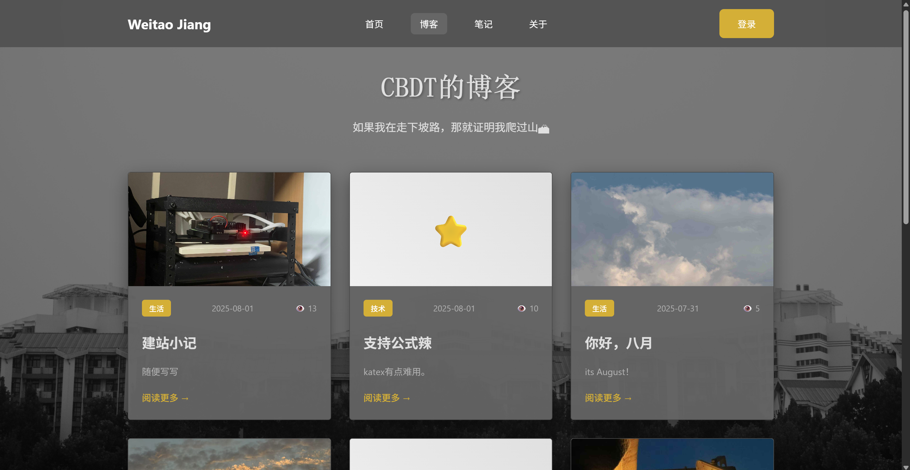
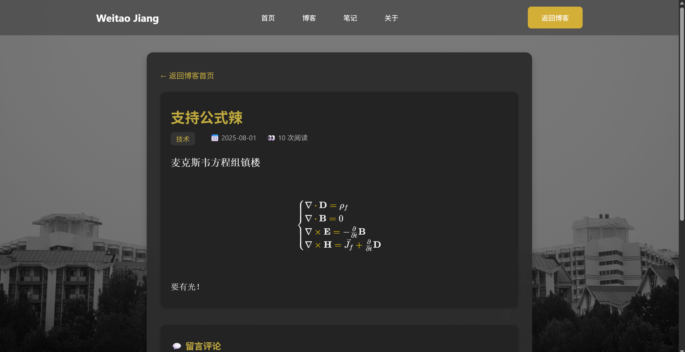

# CBDT的个人主页

我的个人主页。这个代码是copilot写的。后面的内容也是copilot写的。
## 效果展示



## ✨ 特性

本系统提供了完整的Markdown语法支持，包含KaTeX数学公式渲染功能，让您能够轻松编写包含复杂数学表达式的技术文章。系统采用基于JWT的安全认证机制，确保您的博客内容安全可靠。集成的图片管理系统支持拖拽上传、预览和管理功能，让多媒体内容的发布变得简单直观。

响应式设计确保您的博客在桌面端和移动端都能完美展现，而基于JSON文件的轻量级数据存储方案让系统开箱即用，无需复杂的数据库配置。

## 🛠️ 技术栈

系统后端采用Node.js原生HTTP模块构建，避免了框架的复杂性，确保高性能和轻量化。前端使用原生JavaScript和CSS实现，没有重型框架的负担，加载速度更快。认证系统基于JWT令牌技术，提供无状态的安全认证方案。数据存储采用JSON文件格式，简化了部署和备份流程。数学公式渲染集成了业界领先的KaTeX库，确保复杂公式的完美展现。

## 🚀 快速开始

### 环境要求

使用本系统前，请确保您的开发环境已安装Node.js 14.x或更高版本，以及npm或yarn包管理器。

### 安装和运行

首先克隆项目到本地：通过git clone命令获取源代码，然后进入项目目录。接下来安装项目依赖：运行npm install命令下载所需的依赖包。

在首次启动前，需要初始化数据文件：将示例数据文件复制为实际使用的数据文件。具体操作是将data/posts.example.json复制为data/posts.json，将data/users.example.json复制为data/users.json。

完成数据初始化后，运行npm start命令启动服务器。服务器启动成功后，在浏览器中访问http://localhost:8000即可开始使用博客系统。

### 默认账户

系统提供了一个默认的管理员账户，用户名为admin，密码为hello123。您可以使用此账户登录并开始管理您的博客内容。

## 📁 项目结构

```
├── server.js              # 主服务器文件
├── package.json           # 依赖配置
├── lib/                   # 核心库文件
│   └── jwt-auth.js       # JWT认证模块
├── data/                  # 数据存储目录
│   ├── posts.json        # 文章数据
│   ├── users.json        # 用户数据
│   ├── posts.example.json # 示例文章数据
│   └── users.example.json # 示例用户数据
├── uploads/              # 图片上传目录
├── html/                 # 静态HTML文件
│   ├── index.html       # 主页
│   ├── about-the-author.html # 关于页面
│   └── blog/            # 博客相关页面
│       ├── index.html   # 博客首页
│       ├── post.html    # 文章详情页
│       ├── write-post.html # 写文章页面
│       ├── admin.html   # 管理页面
│       └── *.css/.js    # 样式和脚本文件
└── docs-html/           # 文档HTML文件
```

## 🎯 功能特性

### 文章管理
系统提供了完整的文章管理功能，支持创建、编辑和删除文章操作。编辑器采用Markdown语法，让您能够快速编写格式化的文章内容。特别值得一提的是，系统集成了KaTeX数学公式渲染引擎，能够完美展现复杂的数学表达式和科学公式。文章支持分类和标签功能，便于内容的组织和检索。系统还提供了阅读量统计功能，让您了解文章的受欢迎程度。每篇文章都可以设置发布或草稿状态，给予您充分的发布控制权。

### 用户系统
系统实现了完善的用户管理机制，支持用户注册和登录功能。安全认证基于JWT令牌技术，确保用户身份的可靠验证。所有用户密码均采用SHA-256算法加密存储，保障账户安全。系统设计了三级权限管理体系，包括管理员、编辑者和普通用户角色，不同角色拥有相应的操作权限。管理员可以通过后台界面进行用户信息的查看和管理。

### 图片管理
图片上传功能支持现代化的拖拽操作，让文件上传变得简单直观。系统提供了图片预览和管理界面，方便您查看和组织已上传的图片资源。为了确保服务器稳定运行，系统设置了5MB的图片大小限制。支持主流的图片格式，包括jpg、png、gif和webp等，满足不同场景的使用需求。

### 界面设计
系统采用了现代化的响应式布局设计，能够在各种设备上提供优良的用户体验。无论是桌面电脑还是移动设备，界面都能完美适配屏幕尺寸。整体界面采用暗色主题风格，既显得专业又能减少眼睛疲劳。系统加入了流畅的动画效果，提升了交互的视觉体验。所有的界面交互都经过精心设计，确保用户能够轻松上手使用。

## 🔧 配置

### 服务器配置

您可以通过编辑server.js文件来自定义服务器配置。主要的配置选项包括服务器端口号、数据存储目录和图片上传目录的路径设置。系统默认使用8000端口，您可以根据需要修改为其他端口。

### 环境变量

系统支持通过环境变量进行配置，这种方式特别适合生产环境部署。您可以在启动命令中设置PORT环境变量来指定自定义端口号，例如使用PORT=3000 npm start来在3000端口启动服务。

## 📝 使用指南

### 创建文章

文章创建流程非常简单直观。首先使用管理员账户登录系统，然后点击页面上的"写文章"按钮进入编辑器。在编辑页面中，您需要填写文章的基本信息，包括标题、分类和摘要等。文章内容使用Markdown语法编写，系统提供了实时预览功能方便您查看渲染效果。如果需要为文章添加封面图片，可以通过上传功能选择合适的图片。完成编辑后，您可以先预览文章效果，确认无误后即可发布。

### 用户管理

用户管理功能需要管理员权限才能使用。登录管理员账户后，进入"管理"页面即可看到用户管理区域。在这里您可以查看系统中的所有注册用户，包括他们的基本信息和权限级别。系统支持创建新用户账户，您可以为新用户分配合适的角色权限。管理界面还提供了用户权限的修改功能，让您能够灵活调整不同用户的访问权限。

### 图片管理

图片管理功能集成在文章编辑器中，使用起来非常便捷。在写文章时，点击工具栏中的"图片"按钮即可打开图片上传界面。您可以通过拖拽或点击选择的方式上传图片文件，系统会自动处理图片并生成可用的链接地址。上传成功后，图片链接会自动插入到文章内容中。在管理页面中，您还可以查看所有已上传的图片，并根据需要删除不再使用的图片文件。

## 🛡️ 安全特性

系统在安全性方面采用了多重保护措施。用户认证基于JWT令牌机制，提供了安全可靠的身份验证方案。所有用户密码都经过SHA-256算法加密处理后存储，确保即使数据泄露也无法直接获取明文密码。文件上传功能内置了安全检查机制，防止恶意文件的上传。系统还实现了路径遍历攻击的防护，保护服务器文件系统的安全。CORS跨域配置确保了API接口的安全访问，所有用户输入都经过验证和过滤处理。

## 🤝 贡献

我们热烈欢迎各种形式的贡献，无论是提交Pull Request还是报告Issue都能帮助改进这个项目。如果您希望为项目贡献代码，请先Fork项目到您的账户下，然后创建一个新的功能分支进行开发。完成开发后，请提交您的更改并推送到对应的分支，最后打开Pull Request等待审核。

## 📄 许可证

本项目采用MIT License开源许可证，详细信息请查看LICENSE文件。

## 🙏 致谢

特别感谢KaTeX项目提供了优秀的数学公式渲染解决方案，以及JWT.io为认证令牌技术提供的标准规范。同时也要感谢所有为本项目做出贡献的开发者们，您们的努力让这个项目变得更加完善。

如果这个项目对您有帮助，请不要忘记给个⭐️支持一下！
